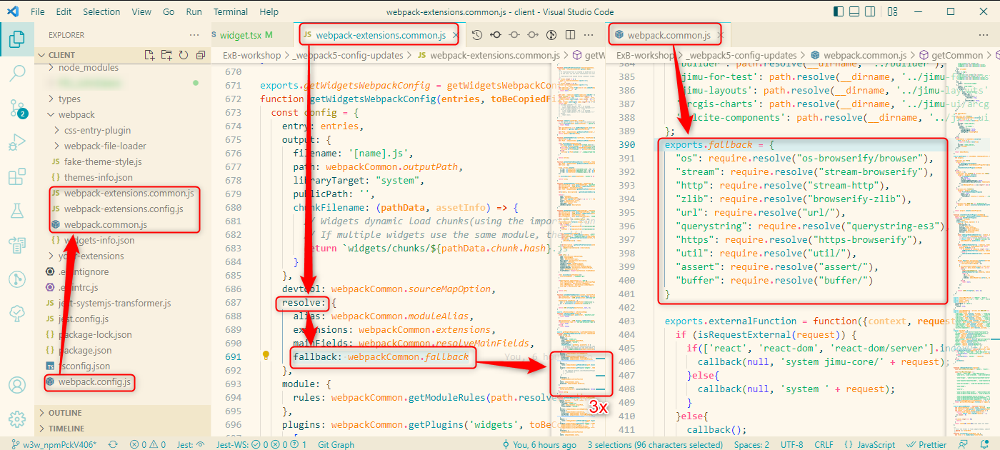

# Experience Builder Workshop Extensions Repo
### by [Niklas Köhn](https://github.com/esride-nik), Esri Deutschland

Some Widgets and a theme.

- [Experience Builder Workshop Extensions Repo](#experience-builder-workshop-extensions-repo)
    - [by Niklas Köhn, Esri Deutschland](#by-niklas-köhn-esri-deutschland)
  - [How to use the samples](#how-to-use-the-samples)
    - [Install dependencies in subfolders](#install-dependencies-in-subfolders)
    - [Using 3rd party NPM packages in your widgets](#using-3rd-party-npm-packages-in-your-widgets)
    - [Optional: Use the demo app locally](#optional-use-the-demo-app-locally)
    - [Extending built-in widgets by inheritance](#extending-built-in-widgets-by-inheritance)
  - [Compiler settings](#compiler-settings)
    - [Cannot find ArcGIS Maps SDK for Javascript modules in Experience Builder ^1.12](#cannot-find-arcgis-maps-sdk-for-javascript-modules-in-experience-builder-112)
    - [Using imports in Jest](#using-imports-in-jest)
    - [Path resolution of ``shared-code``](#path-resolution-of-shared-code)
    - [Using shared code in multiple web-extension-repos](#using-shared-code-in-multiple-web-extension-repos)
  - [Polyfills for Node APIs in Experience Builder \>= 1.8](#polyfills-for-node-apis-in-experience-builder--18)
    - [From left to right:](#from-left-to-right)
    - [Steps to do:](#steps-to-do)
  - [Further info](#further-info)
    - [Looking for the what3words widget?](#looking-for-the-what3words-widget)
    - [Deprecation of NPM package "xlsx"](#deprecation-of-npm-package-xlsx)


## How to use the samples
* Clone the sample repo into your Experience Builder Client root folder and restart your watcher.
* Some widgets depend on 3rd party NPM packages, which need to be installed before compiling. These widgets have their own ``package.json`` in their root folder. Either navigate to the particular folders and execute ``npm i`` in there or run the script ``npm run insts``.

### Install dependencies in subfolders
* Run ``npm run insts`` right in the repository root. This will scan through the widget folders and install all dependencies.
* Run ``npm run insts -- -af`` to perform an ``npm audit fix`` in the same subfolders.

### Using 3rd party NPM packages in your widgets

It's a good practice to ``npm init`` within the widget folder and install dependencies there. During development, it will work also with a central ``package.json`` file containing the dependencies for all your widgets (resulting in one single ``node_modules`` folder outside ``widgets``), but fails to resolve dependencies for production use. We'll end up with one ``package.json`` per widget using packages, but that's what ``npm run insts`` (see above) is for.
For example, when following [this guide](https://doc.arcgis.com/de/experience-builder/11.0/configure-widgets/add-custom-widgets.htm), the ``npm run build:prod`` will not find the installed packages after copying only the subfolder with your widget into ``your-extensions/widgets``.

### Optional: Use the demo app locally
* Link the config of the app in the server folder:
  * Open command prompt (does not work with Git Bash or similar)
  * If the subfolders ``public\apps`` do not yet exist on the server side, create them manually
  * Create a link, mapping the source folder in the server directory to the apps folder in the repo:
    ``mklink /J <exb_path>\server\public\apps\exb_demo <exb_path>\client\ExB-workshop\apps\exb_demo``
  * The success message: ``Junction created for <exb_path>\server\public\apps\exb_demo <<===>> <exb_path>\client\ExB-workshop\apps\exb_demo``

* In the file ``client/tsconfig.json``, include the folder name of the repository in the include array. Or remove / comment out the include array completely from the file.
* Restart Watcher (call ``npm start`` in the client folder)

### Extending built-in widgets by inheritance
As an example, ``widgets/maplyr-ext`` adds custom actions to the standard ``map-layers`` widget.
Steps:
* copy the original class-based widget from ``dist/widgets/arcgis`` into ``<your repo folder>/widgets`` or ``your-extensions/widgets``
* rename ``widget.tsx`` to ``<widget-name>.tsx``, e.g. ``map-layers.tsx``, in there:
  * create a new empty ``widget.tsx`` in the ``runtime`` folder, next to the renamed original file
  * import original widget with alias name: ``import { Widget as <Widget-Name> } from '<widget-name>.tsx``
  * create your own derived widget class: ``export default class Widget extends <Widget-Name>``
  * overwrite methods as needed, but call ``super.<method>()`` to keep the functionality of the base class

## Compiler settings

### Cannot find ArcGIS Maps SDK for Javascript modules in Experience Builder ^1.12

The patch as suggested [here](https://community.esri.com/t5/arcgis-experience-builder-questions/cannot-find-arcgis-maps-sdk-for-javascript-module/m-p/1308587#M7620) does not work for me. I need to remove the ``include`` array from tsconfig.json (no whitelist means including everyting).

Additionally, in ExB 1.12, the TypeScript definition file is missing. [Download from here](https://github.com/Esri/jsapi-resources/tree/main/typescript/archive), place in ``client/types`` and rename to ``arcgis-js-api.d.ts``.


### Using imports in Jest

For Jest to be able to import anything, add ``"esModuleInterop": true`` to your ``tsconfig.json``.

### Path resolution of ``shared-code``

By default, the ``paths.widgets`` array in your ``tsconfig.json`` only contains a reference to ``"./your-extensions/widgets/*"``. To enable the TS compiler to find your shared code when importing it in your widget and business code, enhance the array with the folder names of the repositories with ``/widgets/`` postfix:

```
"paths": {
  [...]
  "widgets/*": [
    "./your-extensions/widgets/*",
    "./<your_repository>/widgets/*"
  ]
}
```

### Using shared code in multiple web-extension-repos

To ensure that no entries are overwritten, the central ``ts`` file with the collected exports should be named individually. For example, instead of ``entry1.ts``, you would be using ``entry_<project_name>.ts`` in your repository.

## Polyfills for Node APIs in Experience Builder >= 1.8

Webpack 5 no longer includes polyfills for node core modules. This manifests in the error message ``BREAKING CHANGE: webpack < 5 used to include polyfills for node.js core modules by default``, meaning: Packages that use node.js core modules no longer work natively with webpack 5.

For more information on this topic, here is a good explanation: "[Webpack 4 automatically polyfilled many node APIs in the browser. This was not a great system, because it could lead to surprisingly giant libraries getting pulled into your app by accident, and it gave you no control over the exact versions of the polyfills you were using. So Webpack 5 removed this functionality.](https://gist.github.com/ef4/d2cf5672a93cf241fd47c020b9b3066a)"

There are many descriptions for the workaround, directly in the error messages in the console and also under the above mentioned source: The required sources have to be entered in ``webpack.config`` under ``resolve.fallback`` and installed via ``npm i``.

So far so good. Except that this configuration has been chopped up in ArcGIS Experience Builder and spread over several files:



### From left to right:
* ``webpack.config.js`` in the ``client`` root folder referencing ``webpack-extensions.config.js`` in the ``webpack`` subfolder.
* ``webpack-extensions.config.js`` builds the config from references to ``webpack-extensions.common.js``
* ``webpack-extensions.common.js`` references the actual polyfills in ``webpack.common.js``.

### Steps to do:
* In ``webpack-extensions.common.js``, add a ``fallback`` property to the ``resolve`` object in 3 places: ``getTemplatesWebpackConfig()``, ``getWidgetsWebpackConfig()`` and ``getThemesWebpackConfig()``:
    ```
    resolve: {
        alias: webpackCommon.moduleAlias,
        extensions: webpackCommon.extensions,
        mainFields: webpackCommon.resolveMainFields,
        fallback: webpackCommon.fallback
    },
    ```
* In ``webpack.common.js``, add the references to the polyfilled packages under ``exports.fallback``, e.g.:
    ```
    exports.fallback = {
        "os": require.resolve("os-browserify/browser"),
        "util": require.resolve("util/"),
        "http": require.resolve("stream-http"),
        "url": require.resolve("url/"),
        "stream": require.resolve("stream-browserify"),
        "https": require.resolve("https-browserify"),
        "zlib": require.resolve("browserify-zlib"),
        "assert": require.resolve("assert/"),
        "buffer": require.resolve("buffer/"),
    }
    ```
* ToDo: Install all referenced NPM packages on ``client`` level, e.g.:
    ```
    npm i os-browserify
    npm i util
    npm i stream-http
    npm i stream-browserify
    npm i https-browserify
    npm i browserify-zlib
    npm i buffer
    npm i assert
    npm i url
    npm i querystring-es3
    ```

That works.

The trouble is, that the webpack files on root level of the "client" folder are not part of the "exb-web-extension-repo", but are delivered with ExB. Now if you use NPM packages in your custom widgets that require polyfills, you have to update the webpack configs on Node JS root level. Please refer to the ``_webpack5-config-updates`` subfolder in this repository for sample files.

[Originally published in the ArcGIS community.](https://community.esri.com/t5/arcgis-experience-builder-questions/npm-packages-in-experience-builder-1-8/m-p/1181885#M4574)

## Further info

### Looking for the what3words widget?
This one was moved to its own repo: [w3w-arcgis-exb-widget](https://github.com/EsriDE/w3w-arcgis-exb-widget)

### Deprecation of NPM package "xlsx"

This package is based on the Excel tool library "SheetJS" and is no longer maintained.
The GitHub advisory db says: "[All versions of SheetJS CE through 0.19.2 are vulnerable to "Prototype Pollution" when reading specially crafted files. Workflows that do not read arbitrary files (for example, exporting data to spreadsheet files) are unaffected.](https://github.com/advisories/GHSA-4r6h-8v6p-xvw6)" As we're not reading anything, I guess it's not that urgent..
.. but maybe try out [Mr.Excel](https://www.npmjs.com/package/mr-excel) some day?
