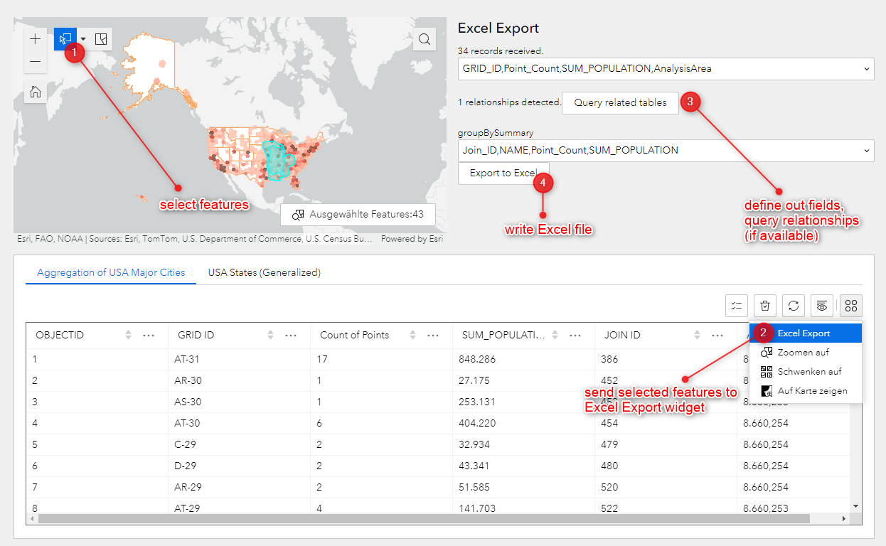

# Excel Export

This widget exports selected records from an attribute table to an Excel file and also queries related tables from the layer. After that, a multiselectable field list is provided, which makes it possible to leave out fields in the export.

### How to use the sample
Clone the sample repo into your Experience Builder Client root folder and restart your watcher.

### How it works
The widget defines a <b>data action that needs to be enabled on a table widget</b>, configured in your app. This data action transmits data from the table into the Excel Export widget for further processing.

#### Author
Niklas Köhn, Esri Deutschland GmbH
